# 🚀 AdStacks Dashboard

A modern, responsive **Flutter Dashboard** designed for office management. Built with clean architecture, reusable widgets, and a polished purple-themed interface that works seamlessly across **Web, Tablet, and Mobile**.

---

## 📸 Preview

### 💻 Desktop

| Home | Employees |
|-------|-----------|
| 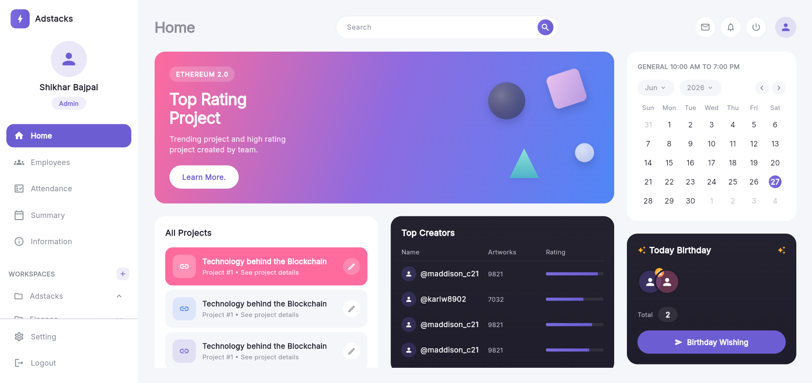 | 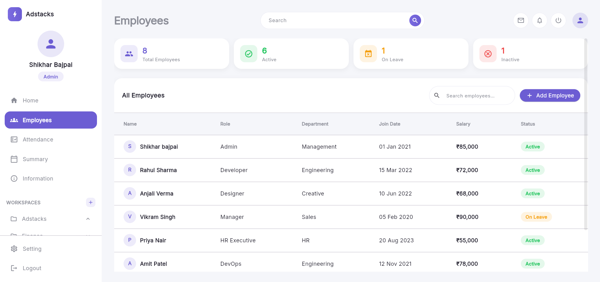 |

| Attendance | Summary |
|------------|---------|
| 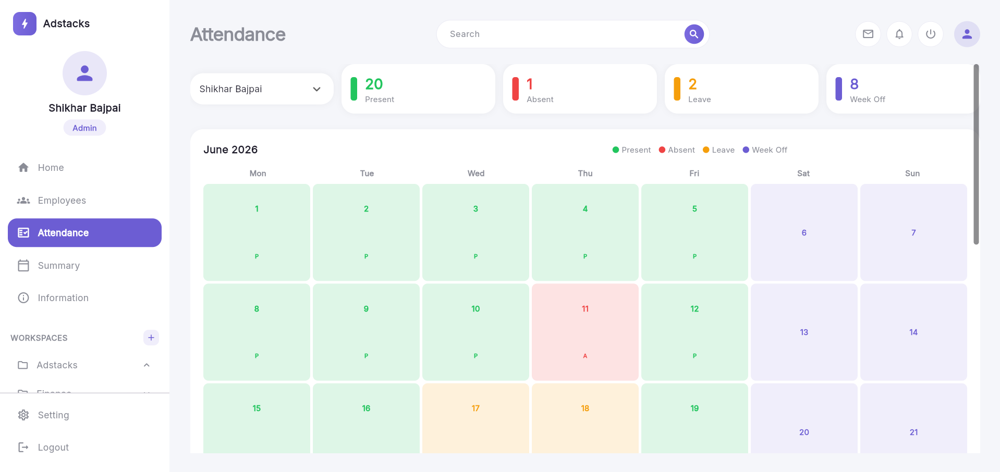 | 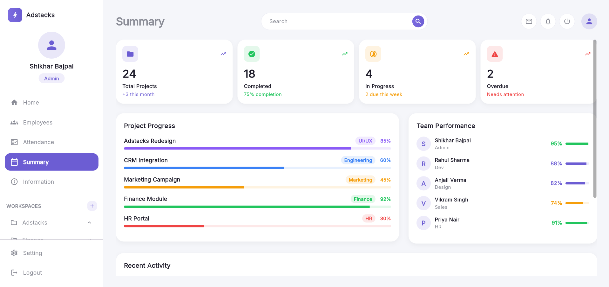 |

| Information | Settings |
|-------------|----------|
| 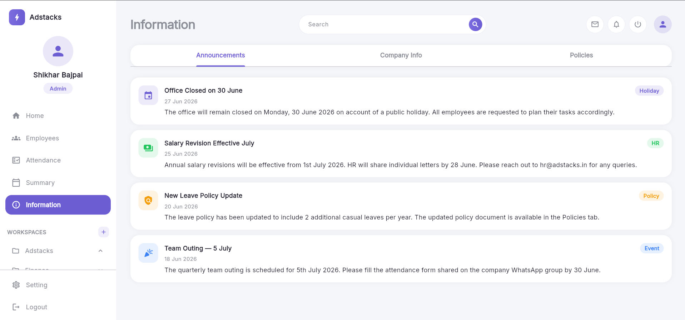 | 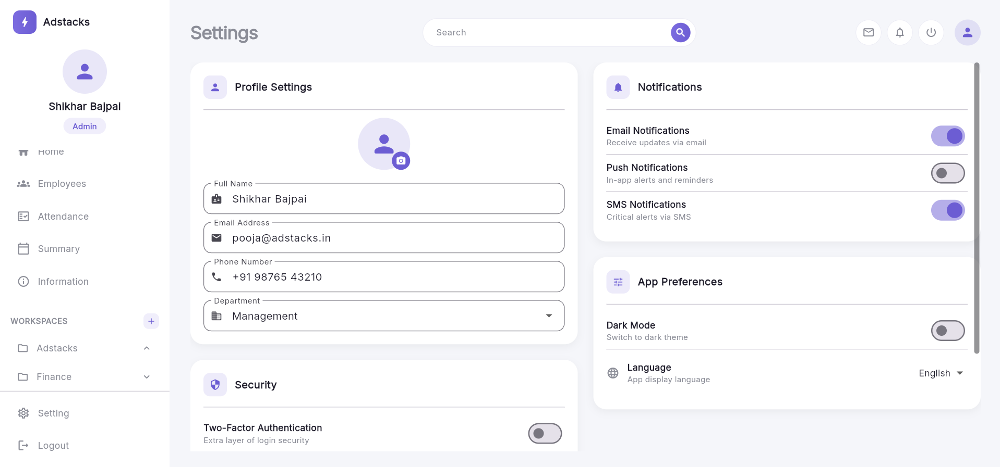 |

---

### 📱 Mobile

<p align="center">
  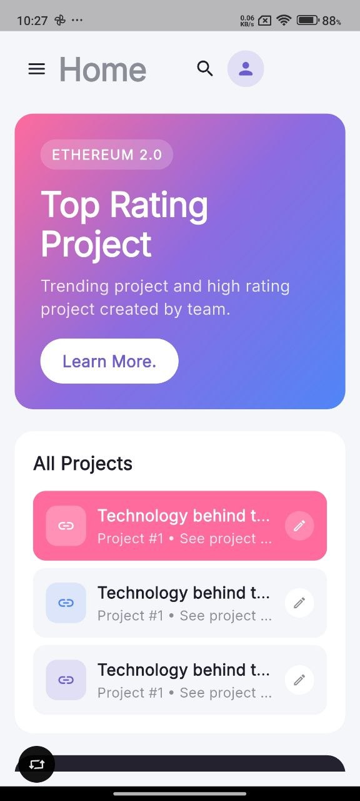
  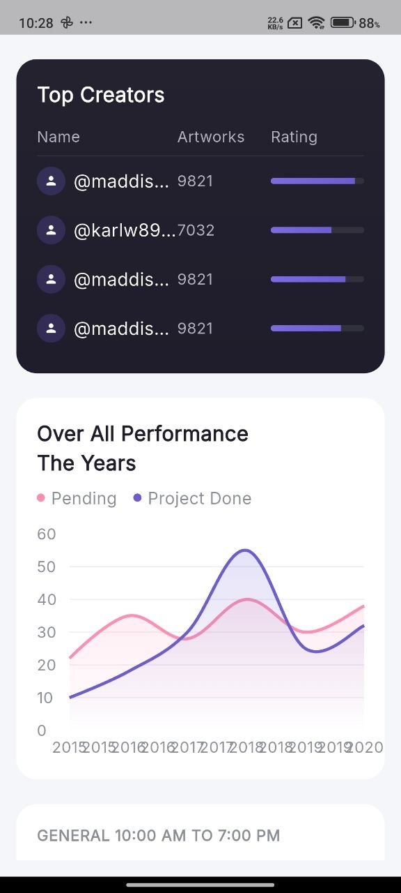
  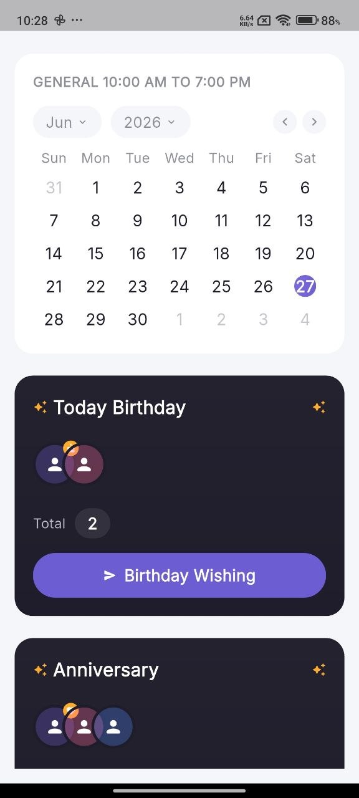
  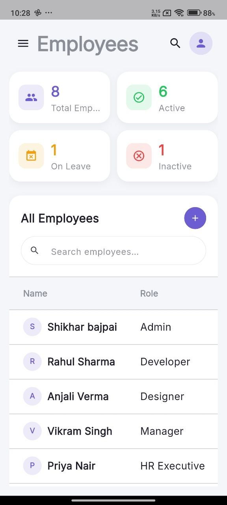
</p>

<p align="center">
  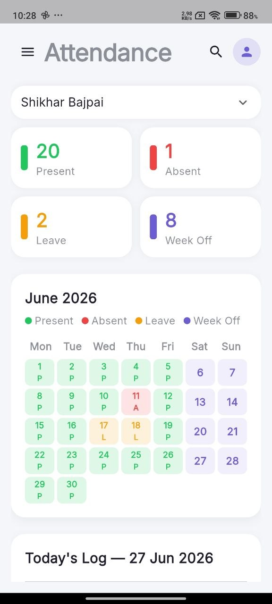
  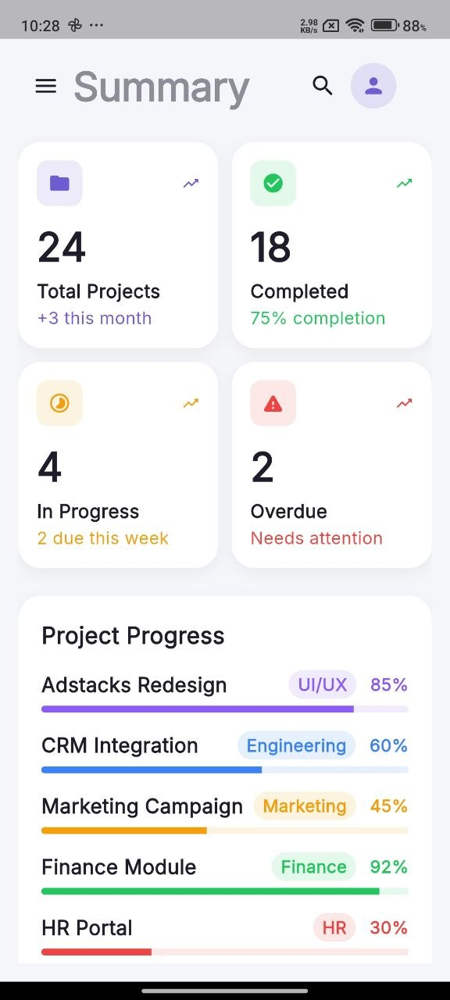
  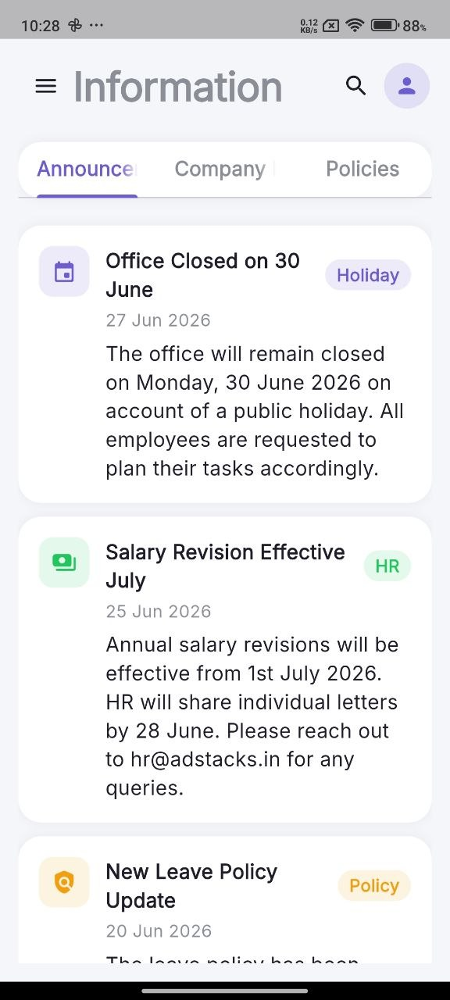
  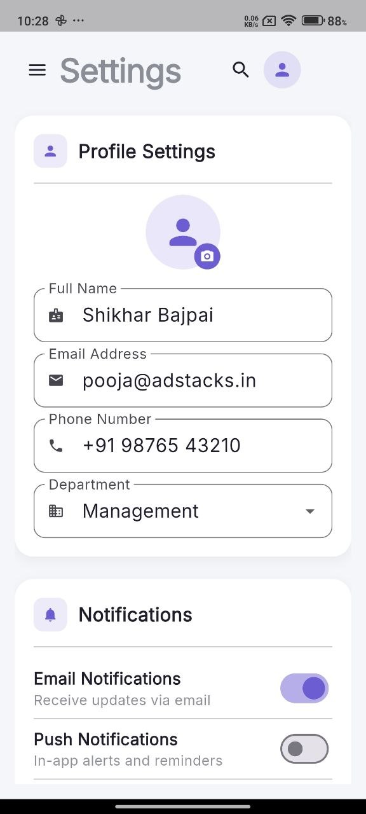
</p>

---

## ✨ Features

- Responsive layout for **Desktop, Tablet & Mobile**
- Modern office dashboard UI
- Interactive analytics & performance charts
- Employee management module
- Attendance tracking with calendar
- Project summary dashboard
- Company announcements & information
- Settings & profile management
- Smooth navigation with adaptive sidebar
- Reusable widget-based architecture

---

## 🛠 Tech Stack

- **Flutter**
- **Dart**
- **Google Fonts**
- **fl_chart**
- **table_calendar**
- **intl**

---

## 📂 Project Structure

```text
lib/
├── main.dart
├── theme/
├── utils/
├── widgets/
└── screens/
```

---

## 🚀 Getting Started

### Prerequisites

- Flutter SDK >= 3.27.4
- Dart SDK >= 3.0.0

### Installation

```bash
git clone https://github.com/shikhar11x/adStacks_Dashboard.git

cd adStacks_Dashboard

flutter pub get

flutter run
```

### Run on Web

```bash
flutter run -d chrome
```

---

## 🌐 Live Demo

🔗 **Vercel**

https://ad-stacks-dashboard-shikhar11x.vercel.app/

---

## 📐 Responsive Layout

| Device | Layout |
|---------|--------|
| Mobile | Drawer Navigation |
| Tablet | Fixed Sidebar |
| Desktop | Three Column Dashboard |

---

## 🎨 Design System

| Property | Value |
|----------|-------|
| Primary Color | `#6C5CE7` |
| Border Radius | `20px` |
| Typography | Google Fonts (Inter) |
| Theme | Modern Purple Dashboard |

---

## 📦 Packages Used

| Package | Version |
|----------|---------|
| flutter | SDK |
| google_fonts | ^8.1.0 |
| fl_chart | ^1.2.0 |
| table_calendar | ^3.2.0 |
| intl | ^0.20.2 |

---

## 🎯 Assignment Highlights

This project demonstrates:

- Responsive Flutter UI
- Clean architecture
- Reusable widgets
- Adaptive navigation
- State management
- Third-party package integration
- Modern dashboard design principles

---

## 👨‍💻 Author

**Shikhar Bajpai**

Flutter Developer

- GitHub: https://github.com/shikhar11x

---

## 📄 License

This project was developed as part of a Flutter technical assignment and is intended for educational and portfolio purposes.
